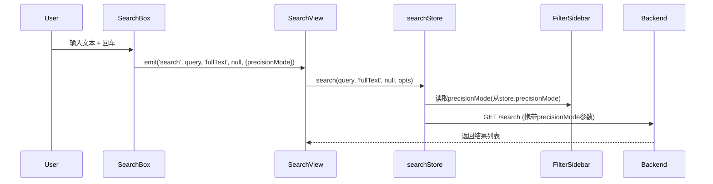
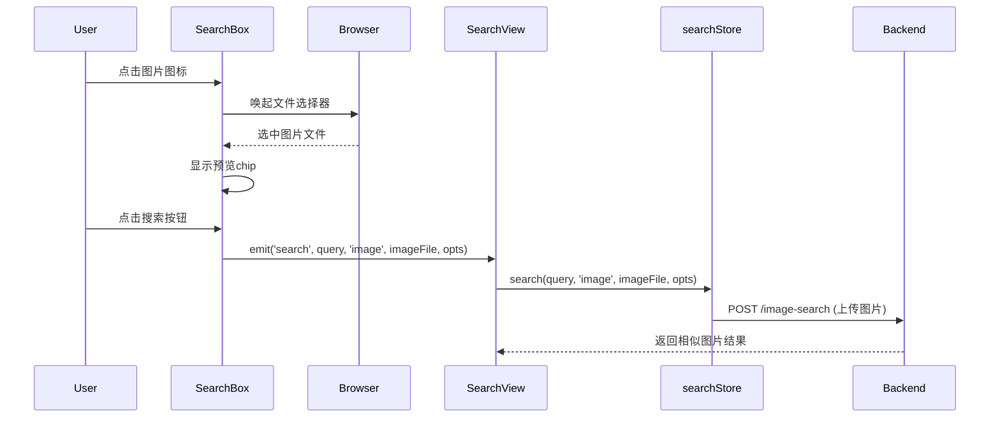
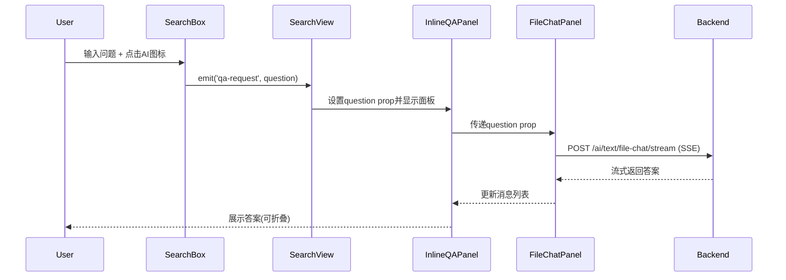
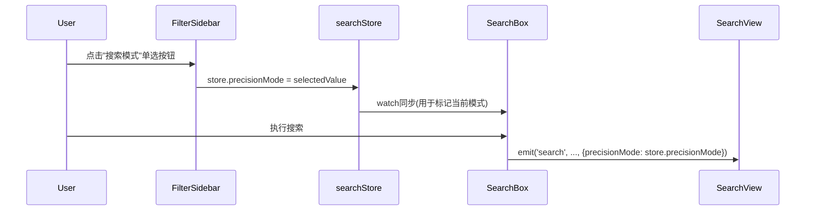

# Design: SearchBox Refactor & Inline QA

## Architecture Overview

### Component Hierarchy (Before)
```
SearchView.vue
├── SearchBox.vue
│   ├── el-select (searchType: fullText/image/qa)
│   ├── el-select (textSearchMode: 1/2/3) ← 条件显示
│   ├── el-button (image upload) ← 条件显示
│   └── el-button (search)
├── FilterSidebar.vue
│   ├── 文件空间
│   ├── 创建者
│   ├── 时间范围
│   └── ...
└── (QA view切换) → FileChatPanel.vue
```

### Component Hierarchy (After)
```
SearchView.vue
├── SearchBox.vue (简化版)
│   ├── el-input (textarea) ← 主输入框
│   ├── el-icon (Picture) ← 图片搜索图标
│   ├── el-icon (MagicStick) ← AI问答图标(炫彩)
│   └── el-button (Search) ← 搜索按钮
├── InlineQAPanel.vue (新增)
│   └── FileChatPanel.vue (复用)
├── FilterSidebar.vue (增强版)
│   ├── **搜索模式** ← 新增section
│   │   └── el-radio-group (快速/精准/模糊)
│   ├── 文件空间
│   ├── 创建者
│   └── ...
└── (搜索结果列表)
```

## Data Flow

### 1. 全文搜索流程(默认)


### 2. 图片搜索流程


### 3. AI问答流程(新)


### 4. 模式选择流程(新位置)


## Component API Design

### SearchBox.vue (重构后)

#### Props
```typescript
interface Props {
  initialQuery?: string; // 初始查询文本
}
```

#### Events
```typescript
interface Events {
  search: (query: string, searchType: 'fullText'|'image', imageFile: File|null, options: {precisionMode: number}) => void;
  'qa-request': (question: string) => void; // 新增
}
```

#### Template Structure
```vue
<template>
  <div class="search-box-modern">
    <!-- 主输入区 -->
    <div class="input-container">
      <el-input
        v-model="searchQuery"
        type="textarea"
        :rows="2"
        placeholder="输入搜索关键词(回车搜索)或问题(点击AI图标)..."
        @keydown.enter.exact.prevent="handleEnterSearch"
      />
      
      <!-- 图片预览chip (条件显示) -->
      <transition name="slide-down">
        <div v-if="imagePreview" class="image-chip">
          
          <span>{{ imageFile.name }}</span>
          <el-icon @click="removeImage"><Close /></el-icon>
        </div>
      </transition>
    </div>

    <!-- 操作按钮组 -->
    <div class="action-bar">
      <!-- 图片搜索图标 -->
      <el-tooltip content="图片搜索" placement="top">
        <el-button
          class="icon-btn image-btn"
          circle
          @click="triggerImageSelect"
        >
          <el-icon><Picture /></el-icon>
        </el-button>
      </el-tooltip>

      <!-- AI问答图标(炫彩) -->
      <el-tooltip content="AI问答" placement="top">
        <el-button
          class="icon-btn ai-btn"
          circle
          :disabled="!searchQuery.trim()"
          @click="handleAIQuestion"
        >
          <el-icon><MagicStick /></el-icon>
        </el-button>
      </el-tooltip>

      <!-- 搜索按钮 -->
      <el-button
        type="primary"
        class="search-btn"
        @click="handleSearch"
      >
        <el-icon><Search /></el-icon>
        搜索
      </el-button>
    </div>

    <!-- 隐藏文件输入 -->
    <input ref="fileInput" type="file" accept="image/*" hidden @change="handleImageSelect" />
  </div>
</template>
```

### InlineQAPanel.vue (新组件)

#### Props
```typescript
interface Props {
  question: string;       // 用户问题
  visible: boolean;       // 是否显示面板
}
```

#### Events
```typescript
interface Events {
  close: () => void;     // 关闭面板
}
```

#### Template Structure
```vue
<template>
  <transition name="expand">
    <div v-if="visible" class="inline-qa-panel">
      <!-- 头部 -->
      <div class="qa-header">
        <div class="title">
          <el-icon class="ai-icon"><MagicStick /></el-icon>
          <span>AI 回答</span>
        </div>
        <div class="actions">
          <el-button text @click="handleCollapse">
            {{ collapsed ? '展开' : '收起' }}
          </el-button>
          <el-button text @click="$emit('close')">
            <el-icon><Close /></el-icon>
          </el-button>
        </div>
      </div>

      <!-- 问答内容区 -->
      <div v-show="!collapsed" class="qa-content">
        <FileChatPanel
          :fileId="''"
          :esId="''"
          url="/admin-api/rag/ai/text/general-chat/stream"
          :defaultUseContext="false"
          :sessionchat="false"
          :showReturn="false"
          chatType="general"
          :initialQuestion="question"
        />
      </div>
    </div>
  </transition>
</template>
```

### FilterSidebar.vue (增强)

#### 新增Section结构
```vue
<!-- 搜索模式 (新增,置于顶部) -->
<div class="filter-section search-mode-section">
  <div class="section-title" @click="toggleSection('searchMode')">
    搜索模式
    <el-icon :class="['toggle-icon', { expanded: expandedSections.searchMode }]">
      <ArrowDown />
    </el-icon>
  </div>
  <div v-show="expandedSections.searchMode" class="section-content">
    <el-radio-group v-model="searchMode" class="mode-radio-group">
      <el-radio :label="1">
        <span>快速</span>
        <el-tooltip content="全文检索,速度最快" placement="right">
          <el-icon class="info-icon"><QuestionFilled /></el-icon>
        </el-tooltip>
      </el-radio>
      <el-radio :label="2">
        <span>精准</span>
        <el-tooltip content="段落级匹配,精度较高" placement="right">
          <el-icon class="info-icon"><QuestionFilled /></el-icon>
        </el-tooltip>
      </el-radio>
      <el-radio :label="3">
        <span>模糊</span>
        <el-tooltip content="混合检索,平衡速度与精度" placement="right">
          <el-icon class="info-icon"><QuestionFilled /></el-icon>
        </el-tooltip>
      </el-radio>
    </el-radio-group>
  </div>
</div>
```

## Style Guide

### AI按钮样式(炫彩设计)
```scss
.ai-btn {
  background: linear-gradient(135deg, #667eea 0%, #764ba2 50%, #f093fb 100%);
  border: none;
  color: white;
  box-shadow: 0 4px 15px rgba(102, 126, 234, 0.4);
  transition: all 0.3s cubic-bezier(0.4, 0, 0.2, 1);

  &:hover {
    transform: translateY(-2px);
    box-shadow: 0 6px 20px rgba(102, 126, 234, 0.6);
    background: linear-gradient(135deg, #764ba2 0%, #667eea 50%, #f093fb 100%);
  }

  &:active {
    transform: translateY(0);
  }

  &:disabled {
    background: #e0e0e0;
    box-shadow: none;
    opacity: 0.6;
  }
}
```

### InlineQAPanel样式(渐变边框)
```scss
.inline-qa-panel {
  margin-top: 16px;
  border-radius: 12px;
  background: white;
  overflow: hidden;
  box-shadow: 0 4px 20px rgba(0, 0, 0, 0.08);
  position: relative;

  &::before {
    content: '';
    position: absolute;
    inset: 0;
    border-radius: 12px;
    padding: 2px;
    background: linear-gradient(135deg, #667eea, #764ba2, #f093fb);
    -webkit-mask: linear-gradient(#fff 0 0) content-box, linear-gradient(#fff 0 0);
    -webkit-mask-composite: xor;
    mask-composite: exclude;
  }

  .qa-header {
    background: linear-gradient(135deg, rgba(102, 126, 234, 0.05), rgba(240, 147, 251, 0.05));
    padding: 12px 16px;
    display: flex;
    justify-content: space-between;
    align-items: center;

    .ai-icon {
      color: #667eea;
      font-size: 20px;
    }
  }
}
```

## Migration Strategy

### Phase 1: 准备工作
1. 创建 `InlineQAPanel.vue` 组件骨架
2. 在 `FilterSidebar.vue` 添加"搜索模式"section(不破坏现有布局)
3. 备份 `SearchBox.vue` 为 `SearchBoxLegacy.vue`

### Phase 2: SearchBox重构
1. 移除 `searchType` 下拉选择器
2. 移除 `textSearchMode` 下拉选择器
3. 将上传按钮改为图片图标
4. 新增AI图标按钮
5. 调整布局和样式

### Phase 3: InlineQAPanel集成
1. 在 `SearchView.vue` 引入 `InlineQAPanel`
2. 监听 `SearchBox` 的 `qa-request` 事件
3. 控制QA面板显示/隐藏
4. 测试流式问答功能

### Phase 4: FilterSidebar增强
1. 将模式选择器逻辑从 `SearchBox` 移至 `FilterSidebar`
2. 同步 `store.precisionMode` 状态
3. 添加tooltip说明

### Phase 5: 样式优化
1. 应用AI按钮渐变样式
2. 应用QA面板渐变边框
3. 调整响应式布局
4. 测试暗色模式兼容性

## Testing Strategy

### Unit Tests
- `SearchBox.vue`: 测试图片选择、AI按钮禁用逻辑、事件发射
- `InlineQAPanel.vue`: 测试折叠/展开、关闭功能
- `FilterSidebar.vue`: 测试模式选择器与store同步

### Integration Tests
- 全文搜索: 输入→回车→结果展示
- 图片搜索: 选择图片→搜索→结果展示
- AI问答: 输入问题→点击AI图标→QA面板展示答案
- 模式切换: FilterSidebar选择模式→搜索→携带正确precisionMode参数

### E2E Scenarios
1. 用户输入"年度报告"并回车 → 显示搜索结果
2. 用户点击图片图标上传logo.png → 显示相似图片
3. 用户输入"如何使用本系统?"点击AI图标 → QA面板展示回答
4. 用户在FilterSidebar切换"精准"模式后搜索 → 结果符合精准匹配

## Rollback Plan
1. 保留 `SearchBoxLegacy.vue` 备份
2. 通过feature flag控制新UI启用(`localStorage.getItem('use-new-search-box')`)
3. 如有严重bug,恢复导入 `SearchBoxLegacy.vue`
