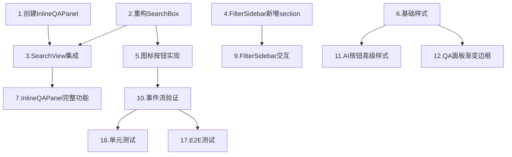

# Tasks: SearchBox Refactor & Inline QA

## Priority Levels
- **P0**: 核心功能,阻塞发布
- **P1**: 重要功能,需在发布前完成
- **P2**: 优化项,可延后

---

## P0: 核心重构 (阻塞发布)

### 1. 创建InlineQAPanel组件骨架
- [ ] 创建 `src/components/search/InlineQAPanel.vue`
- [ ] 定义props: `question`, `visible`
- [ ] 定义emits: `close`
- [ ] 添加基础template结构(header + content区域)
- [ ] 引入 `FileChatPanel` 组件
- [ ] 实现折叠/展开逻辑
- [ ] 验证组件可独立渲染

**验收标准**: 组件可在Storybook中预览,折叠/关闭功能正常

### 2. 重构SearchBox布局
- [ ] 备份 `SearchBox.vue` 为 `SearchBoxLegacy.vue`
- [ ] 移除 `searchType` 下拉选择器相关代码
- [ ] 移除 `textSearchMode` 下拉选择器相关代码
- [ ] 移除图片上传按钮,改为图标按钮
- [ ] 新增AI问答图标按钮(使用 `MagicStick` icon)
- [ ] 调整事件发射逻辑: 移除 `searchType` 参数,默认为 `fullText` 或 `image`
- [ ] 新增 `qa-request` 事件发射
- [ ] 更新样式: 按钮横向排列,间距合理

**验收标准**: SearchBox仅包含输入框+2个图标+搜索按钮,布局紧凑

### 3. SearchView集成InlineQAPanel
- [ ] 在 `SearchView.vue` 引入 `InlineQAPanel`
- [ ] 添加响应式状态: `showQAPanel`, `qaQuestion`
- [ ] 监听 `SearchBox` 的 `@qa-request` 事件
- [ ] 设置 `qaQuestion` 并显示 `InlineQAPanel`
- [ ] 实现QA面板关闭逻辑
- [ ] 调整布局: QA面板位于搜索框下方,结果列表上方

**验收标准**: 点击AI图标后QA面板展示,可关闭,不影响搜索结果区域

### 4. FilterSidebar新增搜索模式section
- [ ] 在 `FilterSidebar.vue` 顶部新增 `search-mode-section`
- [ ] 添加单选组: 快速(1)/精准(2)/模糊(3)
- [ ] 绑定 `v-model="searchMode"`, 初始值从 `store.precisionMode` 读取
- [ ] watch `searchMode` 变化并同步到 `searchStore.precisionMode`
- [ ] 默认展开该section (`expandedSections.searchMode = true`)
- [ ] 添加tooltip解释每个模式含义

**验收标准**: FilterSidebar顶部显示"搜索模式",切换选项时store状态同步

### 5. 图标按钮功能实现
- [ ] 图片图标点击唤起文件选择器
- [ ] 选择图片后显示预览chip(复用现有逻辑)
- [ ] 点击搜索按钮时判断是否有图片: 有则 `emit('search', query, 'image', imageFile)`, 无则 `emit('search', query, 'fullText', null)`
- [ ] AI图标点击时校验输入框非空
- [ ] AI图标点击时发射 `emit('qa-request', searchQuery)`

**验收标准**: 图片搜索流程通畅,AI按钮仅在有输入时可点击

### 6. 基础样式应用
- [ ] SearchBox布局调整: 输入框+操作栏分行
- [ ] 图标按钮统一大小(circle,medium)
- [ ] AI按钮应用基础渐变色(紫-蓝)
- [ ] QA面板基础样式(白底,阴影,圆角)

**验收标准**: 视觉层次清晰,AI按钮有渐变效果

---

## P1: 重要功能 (发布前完成)

### 7. InlineQAPanel完整功能
- [ ] 集成 `FileChatPanel` 并传递正确props
- [ ] 设置问答API URL (`/admin-api/rag/ai/text/general-chat/stream`)
- [ ] 传递 `initialQuestion` 触发自动问答
- [ ] 实现流式响应展示(依赖FileChatPanel)
- [ ] 添加加载状态指示
- [ ] 测试长文本答案显示(滚动)

**验收标准**: 输入问题后QA面板显示流式答案,与FileChatPanel一致

### 8. SearchView交互逻辑完善
- [ ] 修改 `handleSearch` 函数: 移除 `searchType` 参数判断逻辑
- [ ] 修改 `onModeChange` 函数: 移除QA模式切换逻辑
- [ ] 确保搜索时读取 `store.precisionMode` 并传递给API
- [ ] 图片搜索后清空QA面板(避免混淆)
- [ ] QA面板展示时,搜索结果列表不受影响

**验收标准**: 全文/图片搜索正常,问答独立展示,互不干扰

### 9. FilterSidebar交互优化
- [ ] 模式选择器切换时立即触发搜索(可选:添加"选择即搜"toggle)
- [ ] 添加"重置"按钮时不重置搜索模式(保持用户选择)
- [ ] 模式选择器在移动端响应式布局

**验收标准**: 模式切换流畅,不影响其他筛选项

### 10. 事件流验证
- [ ] 测试全文搜索: 输入"测试"回车 → 调用search API携带precisionMode
- [ ] 测试图片搜索: 选择图片点搜索 → 调用image-search API
- [ ] 测试AI问答: 输入"你好"点AI图标 → QA面板展示答案
- [ ] 测试模式切换: FilterSidebar改为"精准" → 搜索时携带precisionMode=2

**验收标准**: 所有事件流端到端通畅

---

## P2: 样式优化 (可延后)

### 11. AI按钮高级样式
- [ ] 应用三色渐变(#667eea → #764ba2 → #f093fb)
- [ ] 添加悬停效果: 渐变方向反转+阴影加深
- [ ] 添加点击动画(ripple效果)
- [ ] 禁用状态灰度处理
- [ ] 响应式尺寸调整

**验收标准**: AI按钮视觉突出,与常规按钮区分明显

### 12. QA面板渐变边框
- [ ] 应用 `::before` 伪元素渐变边框
- [ ] 头部背景半透明渐变
- [ ] AI图标应用渐变色
- [ ] 折叠/展开动画过渡
- [ ] 暗色模式适配

**验收标准**: QA面板有"未来感",边框渐变流畅

### 13. SearchBox整体样式优化
- [ ] 输入框聚焦时边框渐变效果
- [ ] 图标按钮悬停tooltip样式优化
- [ ] 搜索按钮渐变色(保持蓝色主题)
- [ ] 图片预览chip样式优化(圆角,阴影)
- [ ] 响应式布局测试(移动端)

**验收标准**: 搜索框整体视觉和谐,操作反馈明确

### 14. 过渡动画优化
- [ ] QA面板展开/收起使用 `expand` transition
- [ ] 图片chip显示使用 `slide-down` transition
- [ ] AI按钮点击后loading状态(可选)
- [ ] 模式选择器切换时高亮当前选项

**验收标准**: 动画流畅,无卡顿

### 15. 图标选择与替换
- [ ] 确认图片搜索图标(建议: `Picture` 或 `Camera`)
- [ ] 确认AI问答图标(建议: `MagicStick` 或自定义SVG)
- [ ] 统一图标尺寸和颜色
- [ ] 添加图标悬停颜色变化

**验收标准**: 图标语义清晰,视觉统一

---

## P2: 测试与文档 (可延后)

### 16. 单元测试
- [ ] `SearchBox.vue`: 测试图片选择/AI按钮事件发射
- [ ] `InlineQAPanel.vue`: 测试折叠/关闭逻辑
- [ ] `FilterSidebar.vue`: 测试模式选择器store同步

**验收标准**: 测试覆盖率>80%

### 17. E2E测试
- [ ] 全文搜索完整流程
- [ ] 图片搜索完整流程
- [ ] AI问答完整流程
- [ ] 模式切换影响搜索结果

**验收标准**: 所有场景通过

### 18. 文档更新
- [ ] 更新 `README.md` 新增AI问答功能说明
- [ ] 更新组件API文档(props/events)
- [ ] 添加样式变量说明(渐变色定义)

**验收标准**: 文档完整准确

---

## 依赖关系

## 总工作量估算
- **P0任务**: 6个任务 × 2小时 = 12小时 (1.5天)
- **P1任务**: 4个任务 × 1.5小时 = 6小时 (0.75天)
- **P2任务**: 8个任务 × 1小时 = 8小时 (1天)
- **测试与调试**: 4小时 (0.5天)
- **总计**: 30小时 ≈ **3.75天**
