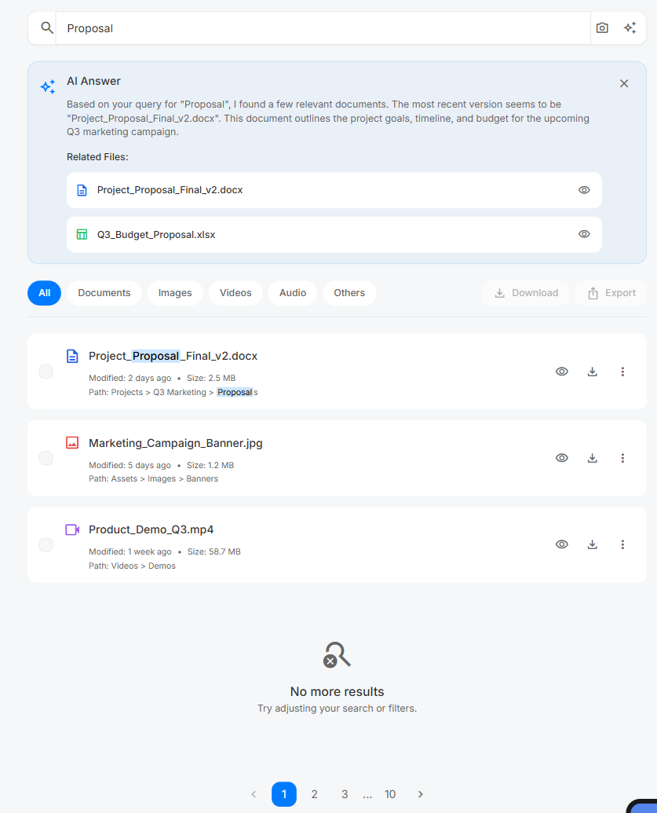
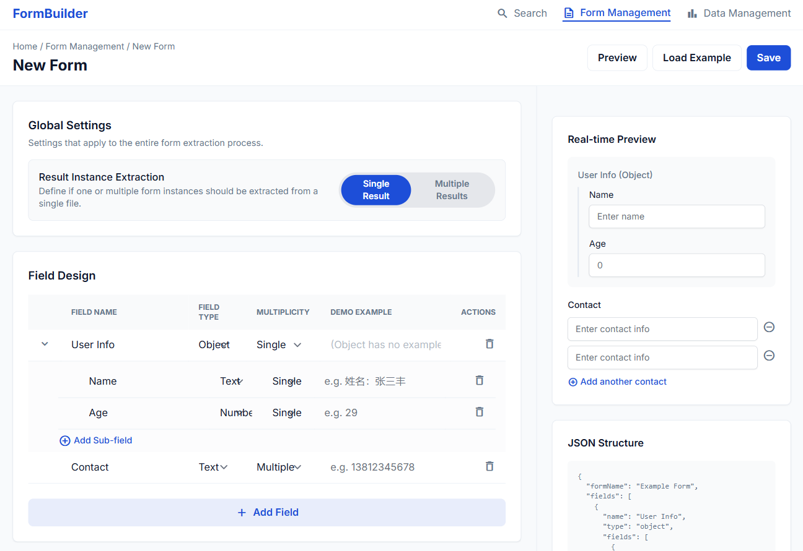
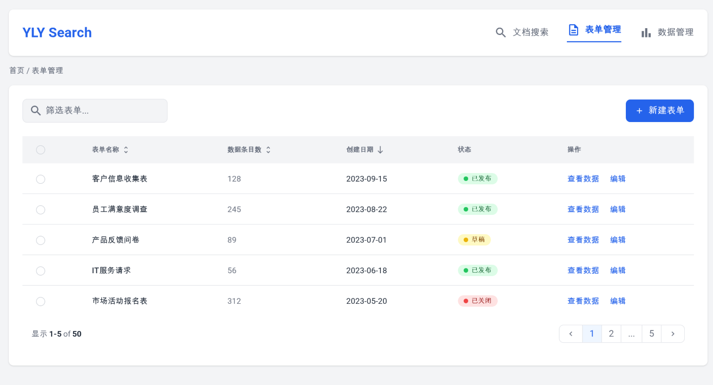
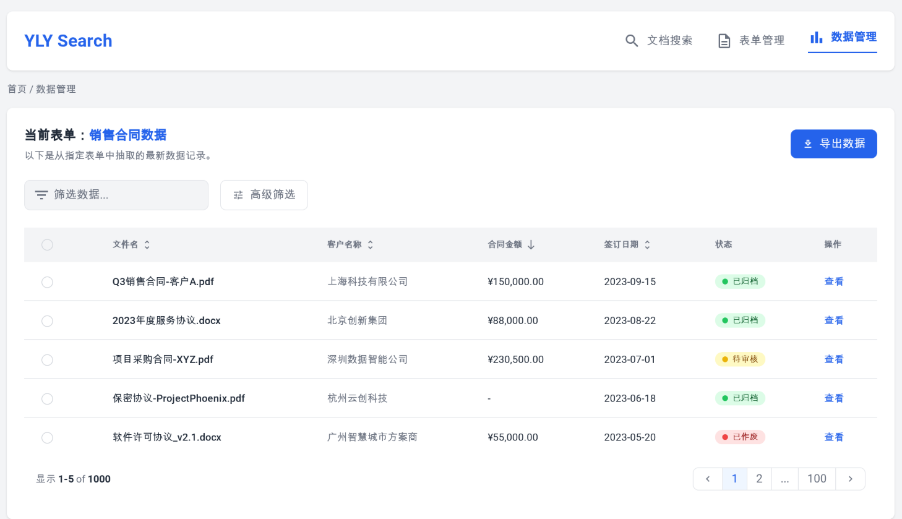
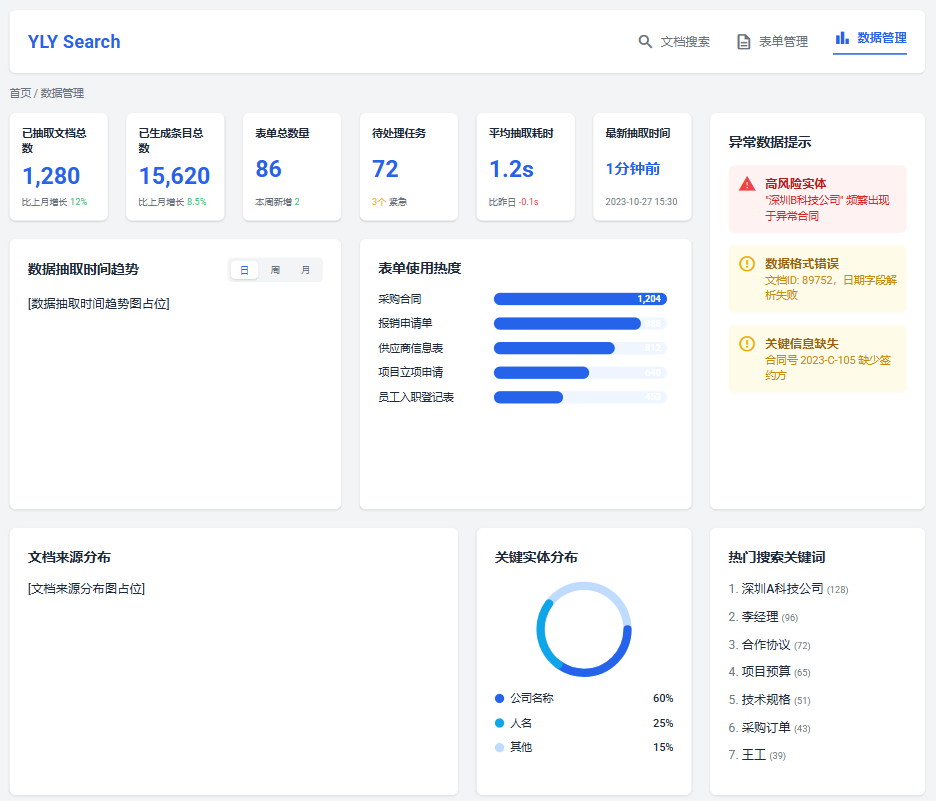
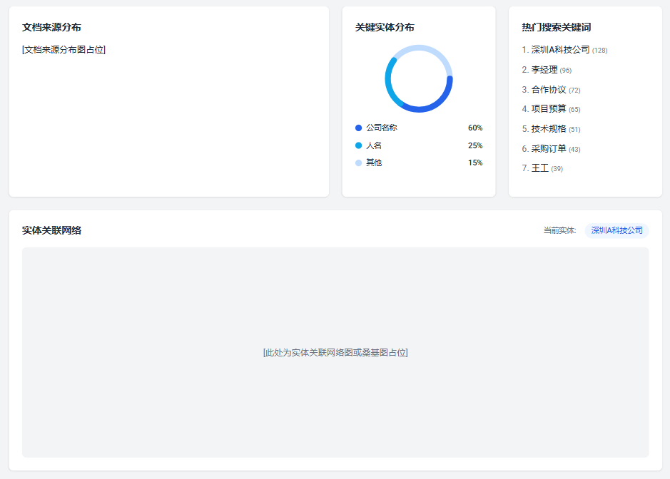
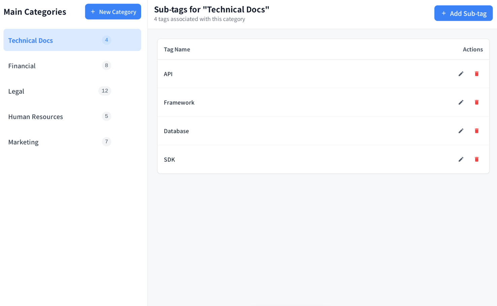

请按以下任务要求，完成对UI的重构

### 任务1、搜索主页样式修改

以上是我们UI重新设计后的效果，除了实现显示的搜索内容条目数据上有差异不用管理他，搜索条，搜索条后面的图片、AI按钮、新增ai输出栏、tab组件风格、整体背景颜色，主色调请都按这个风格调整，

数据逻辑实现和api调用的逻辑请保持不变。

在本项目的代码入口为：[text](../src/views/SearchView.vue)， 其中搜索框为： [text](../src/components/search/SearchBox.vue)， 其他组件你应该都能分析出来

### 任务2、新建表单页面

上图是我们UI重新设计后的效果，新增了整个表单是提取单个数据还是提取多个数据的字段，表单设计UI 改成了可展示式表格的风格，这样就像填写表格一样更加简单的定义数据抽取结构。其他的没有组太大改变，主要是风格与主色的变化，同任务1

[入口页面](../src/views/FormDesignerView.vue) 他引用了两个组件，一个是表单设计器组件 [text](../src/components/form/FormDesigner.vue) 另一个是表单字段编辑组件 [text](../src/components/form/FormFieldEditor.vue) 请按模块化设计，方便后续维护与功能扩展。以及其他相关的内容请都按要求进行重构。

### 任务3、数据表单管理页面

上图是我们UI重新设计后的效果，新增了与这个表单关联的数据结果的字段展示，新增了表单的可使用状态，然后整个UI风格做了修改同任务1、任务2；

[表单入口页面](../src/views/FormsView.vue)，请按模块化设计，方便后续维护与功能扩展。以及其他相关的内容请都按要求进行重构。他里面也有 [ 表单设计页面](../src/views/FormDesignerView.vue)，这部分内容请参考任务2进行重构。

### 任务4、数据表单结果展示页面

上图是我们UI重新设计后的效果，在表单管理界面，点击数据结果字段可以进入这个页面，展示与这个表单关联的数据结果，UI风格做了修改同任务1、任务2、任务3。需要注意的是： 这里的表头就是自定表单的表结构，数据内容是与这个表单关联的数据结果内容。其中如果某个字段是个对象元素，UI中没有实现，需要你帮我组成弹窗形式展示对象内容，弹窗样式请与整体风格保持一致。其中查看按钮，需要改成复制，因为已经是数据结果了，不需要再查看详情了，直接复制数据内容即可。同时由于数据结果是ai抽取出来了，不一定100%符合表格的要求，你需要帮我标记出来，他不符合表格要求的单元格，UI上用红色边框标记出来即可，操作栏目需要新增一个编辑结果的操作按钮，点击后可以弹出一个编辑弹窗，弹窗样式请与整体风格保持一致，弹窗中可以对当前行的数据进行编辑，编辑完成后保存即可更新当前行数据内容。同时需要一个删除按钮，点击后可以删除当前行数据内容。

[页面入口](../src/components/extractions/ExtractionsManager.vue)，请按模块化设计，方便后续维护与功能扩展。以及其他相关的内容请都按要求进行重构。他里面也有 [ 表单数据展示页面](../src/components/extractions/ExtractionsManager.vue)，这

### 任务5、数据抽取统计分析页（1个版本，其实是一张图）

上图是我们UI重新设计后的效果，整个页面分为上下两部分，上半部分是数据抽取的统计分析图表，下半部分是数据抽取的明细数据展示，UI风格做了修改同任务1、任务2、任务3、任务4。需要注意的是： 上半部分的图表样式请与整体风格保持一致，图表颜色请使用主色调进行设计，下半部分的数据表格样式请与整体风格保持一致，数据表格的分页组件样式请与整体风格保持一致。

目前还没有提供后端数据接口，你可以使用模拟数据进行开发（定义好接口的JSON格式），后续我们会提供接口进行对接。注意请按模块设计，方便后续维护与功能扩展。

注意这是一个新增功能页面，代码入口为：[text](../src/views/DataExtractionStatsView.vue)，请一定要按模块化将mockdata、api、service、组件、整体页面拆分设计好。

### 任务6、数据标签分类分级页面

上图是我们UI重新设计后的效果，整个页面分为左侧的标签分类树形结构展示区域，右侧的标签分类详情展示区域，UI风格做了修改同任务1、任务2、任务3、任务4、任务5。需要注意的是： 左侧的标签分类树形结构展示区域，节点样式请与整体风格保持一致，右侧的标签分类详情展示区域，表单样式请与整体风格保持一致。

他是[ 文件分类管理](../src/components/ai/ClassificationPanel.vue) 管理页面中对主题标签管理的维护页面，请阅读他的所有代码，接口，数据结构，他都是正确的，可以正常运行的。

请新增一个页面入口：[标签管理页面](../src/views/DataLabelingView.vue)，进行整体页面的展示与管理。所有的数据逻辑全部采用[文件分类管理](../src/components/ai/ClassificationPanel.vue)中的逻辑。UI样式与这次的整体风格保持一致。请按模块化设计，方便后续维护与功能扩展。

最后请注意：这次UI重构的主色调是 #3B82F6"，请所有新增的组件，页面，弹窗，表单，按钮，图标等UI元素都要使用这个主色调进行设计与实现。并且请确保整体风格的一致性与协调性。

darkMode: "class",
        theme: {
          extend: {
            colors: {
              primary: "#3B82F6",
              "background-light": "#F7F8FA",
              "background-dark": "#18181B",
            },
            fontFamily: {
              display: ["Noto Sans SC", "sans-serif"],
            },
            borderRadius: {
              DEFAULT: "8px",
            },
          },